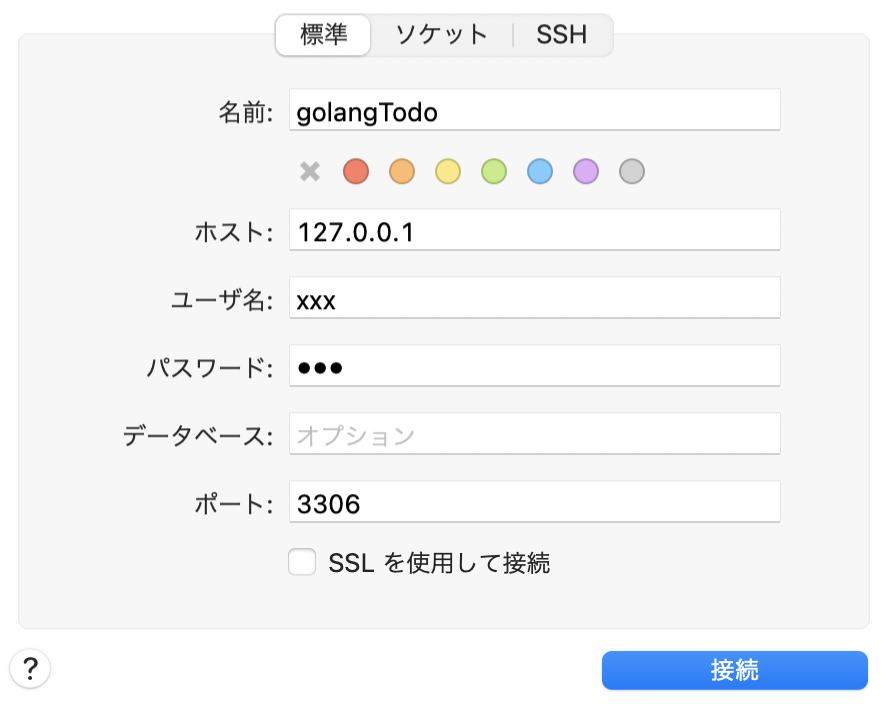

# 目次

<!-- TOC -->

- [目次](#目次)
- [参考サイト](#参考サイト)
- [Go 言語のインストール](#go-言語のインストール)
- [コード実行例](#コード実行例)
- [テストの実行](#テストの実行)
  - [参考 URL](#参考-url)
- [エラーまとめ](#エラーまとめ)
- [API サンプル実行方法](#api-サンプル実行方法)
- [ローカル環境 sequel pro 設定値](#ローカル環境-sequel-pro-設定値)
- [必要ライブラリインストールコマンド](#必要ライブラリインストールコマンド)

<!-- /TOC -->

# 参考サイト

- [フロントエンドエンジニアが Go 言語で ToDo リスト API を作ってみた](https://liginc.co.jp/584227)
- [テスト駆動開発で GO 言語を学びましょう](https://andmorefine.gitbook.io/learn-go-with-tests/)

# Go 言語のインストール

[Download and install](https://go.dev/doc/install) に従う  
↓ のようになればインストール OK

```go
$ go version
go version go1.15.7 darwin/amd64
```

# コード実行例

```go
$ go run helloWorld/hello.go
Hello, world
```

# テストの実行

```go
$ go test
package .: no Go files in 絶対パス
```

となる場合は

- `go mod init hello` しておく
- もしくは`go test`を実行したディレクトリに.go ファイルがない

## 参考 URL

https://andmorefine.gitbook.io/learn-go-with-tests/go-fundamentals/hello-world

# エラーまとめ

- `function main is undeclared in the main package`
  → main 関数が存在しない
- `main redeclared in this block previous declaration at ./hello.go:12:6`
  → main という関数名が被っている

# API サンプル実行方法

`apiSample/endpoint.go` に定義された処理を使う

```sh
docker-compose build # 関数やDockerfileなどに変更があった場合のみ
docker-compose up
```

すると http://localhost:8085 で hello というレスポンスが返ってくる

# ローカル環境 sequel pro 設定値


パスワードは xxx

# 必要ライブラリインストールコマンド

```sh
go get -u github.com/gorilla/mux # 参考：https://github.com/gorilla/mux
```
